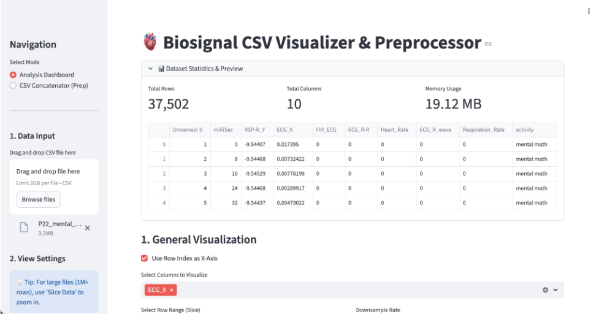
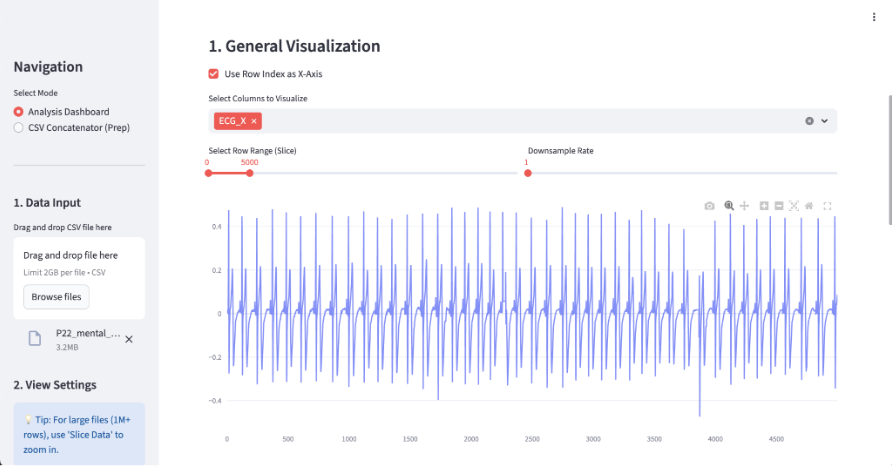
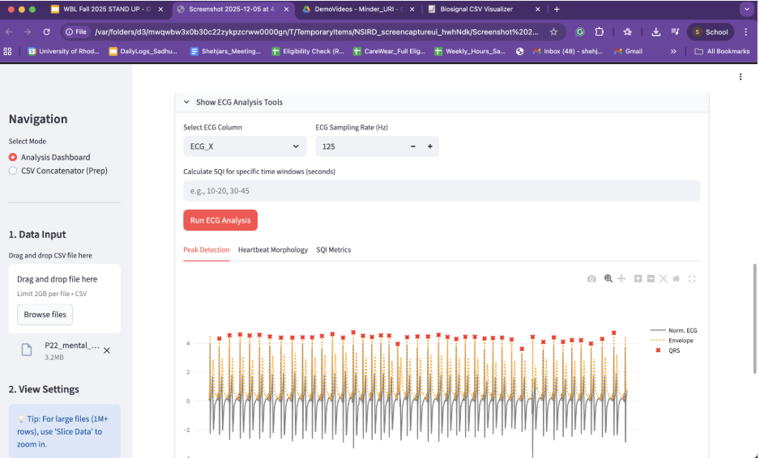

# 🫀 Biosignal CSV Visualizer & Analysis Tool

A containerized Python application for visualizing and analyzing physiological sensor data (ECG, EDA, PPG, Temperature). Built with **Streamlit** and **Plotly**, it handles large CSV datasets (1M+ rows) efficiently through intelligent data slicing and downsampling.


## 📸 Application Preview

### 1. Interactive Time-Series Visualization
Visualize multiple biosignals simultaneously with zoom, pan, and hover capabilities.


### 2. Advanced ECG Analysis (SQI)
Automated QRS detection, Signal Quality Index (SQI) calculation (Skewness, Kurtosis, PSD), and morphological analysis.


### 3. EDA Decomposition
Decompose Electrodermal Activity into Tonic (SCL) and Phasic (SCR) components with artifact removal.


---

## 🚀 Features

* **Drag & Drop Interface:** Easily upload large CSV files generated by biosensors (BioPac, CareWear, etc.).
* **Performance Optimization:**
    * **Data Slicing:** Select specific time windows to analyze, preventing browser crashes on large files.
    * **Downsampling:** View trends across millions of data points without lag.
* **🫀 ECG Module:**
    * Hilbert Transform-based QRS Detection.
    * Morphological Heartbeat Template generation.
    * **SQI Metrics:** Calculate Skewness, Kurtosis, and PSD Ratios for specific time windows.
* **💧 EDA Module:**
    * Z-Score based Artifact Removal.
    * Low-pass filtering (1.5Hz & 10Hz).
    * Decomposition into SCL (Tonic) and SCR (Phasic) components.

---

## 🛠️ Prerequisites

To run this application without dependency conflicts, **Docker Desktop** is required.

* [Download Docker Desktop for Mac (Silicon/Intel)](https://www.docker.com/products/docker-desktop/)
* [Download Docker Desktop for Windows](https://www.docker.com/products/docker-desktop/)

> **⚠️ Note for Mac Users:** Ensure you allocate at least **4GB of RAM** to Docker in `Settings > Resources`, as scientific libraries (Scipy/Numpy) are memory-intensive.

---

## ⚡ Quick Start (Docker)

This is the **recommended** way to run the application. It ensures all libraries (Pandas, Scipy, Plotly) are installed in an isolated environment.

1.  **Open your terminal and navigate to the project folder:**
    ```bash
    cd path/to/biosignal_app
    ```

2.  **Build and Start the Container:**
    ```bash
    docker-compose up --build
    ```

3.  **Access the App:**
    Open your web browser and go to:
    👉 [http://localhost:8501](http://localhost:8501)

4.  **Stop the App:**
    Press `Ctrl + C` in the terminal to stop the server.

---

## 💻 Local Development (Optional)

If you prefer to run it without Docker (requires Python 3.9+):

1.  **Create a Virtual Environment:**
    ```bash
    python3 -m venv venv
    source venv/bin/activate  # On Windows use: venv\Scripts\activate
    ```

2.  **Install Dependencies:**
    ```bash
    pip install -r requirements.txt
    ```

3.  **Run Streamlit:**
    ```bash
    streamlit run biosignal_viz.py
    ```

---

## 📂 Project Structure

```text
biosignal_app/
├── biosignal_viz.py       # Main Application Logic
├── requirements.txt       # Python Dependencies
├── Dockerfile             # Docker Image Configuration
├── docker-compose.yml     # Container Orchestration
├── README.md              # Documentation
└── assets/                # Screenshots for Documentation
    ├── home_screen.png
    ├── ecg_analysis.png
    └── eda_analysis.png